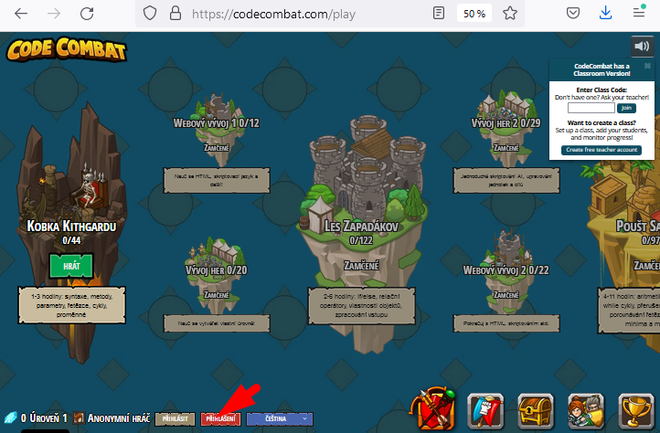

# Registrace na CodeCombat.com

Návod na registraci na webu [CodeCombat.com](https://CodeCombat.com) pro mladší žáky.

Server CodeCombat.com nabízí výuku programování ve formě hry. Píšete příkazy v&nbsp;programovacím jazyce JavaScript či Python a&nbsp;ovládáte tak figurku ve hře. Tím si osvojujete hravou formou syntaxi programovacích jazyků a základní programátorské konstrukce (cykly, větvení).

---

> Pro naše účely nebudeme používat **žádné placené rozšíření**. 
> Pokud po vás systém kdekoli chce platební údaje, **odmítněte je!**
---

1. Otevřete stránku [CodeCombat.com](https://codecombat.com) 
2. Nebudeme používat ClassCode 
3. Po spuštění hry zvolte červené tlačítko „Přihlášení“ 
4. Vytvořte si individuální účet &mdash; ten vám poskytne nejvíce možností: 
5. Zadejte datum narození rodiče (datum, kde bude věk vyšší než 16 let) 
6. Udělte souhlas s&nbsp;umístěním přihlašovacích údajů a postupu hry na servery v&nbsp;USA 
7. Zadejte přihlašovací údaje k&nbsp;účtu. _E-mailová adresa se neověřuje, ale slouží k&nbsp;obnovení přístupu v&nbsp;případě zapomenutí hesla._ 
8. Přihlašovací údaje si zapište, abyste mohli pokračovat v&nbsp;rozehrané hře. 
1. Hodně zdaru! 

<!--1. 
1. 
1. 
1. 
1. 
-->

